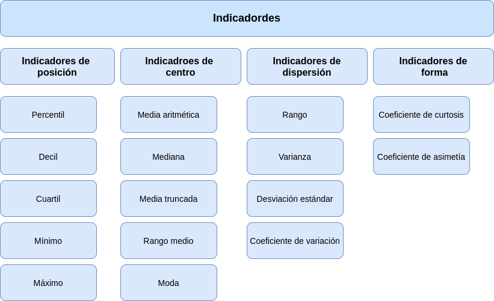

```{r setup, include=FALSE}
library(learnr)
knitr::opts_chunk$set(echo = FALSE,
                 exercise.warn_invisible = FALSE)
# colores
c1="#FF7F00" # NARANJA COLOR PRINCIPAL
c2="#034a94" # AZUL FUERTE COLOR SECUNDARIO  
c3="#0eb0c6" # AZUL CLARO COLOR TERCEARIO  
c4="#686868" # GRIS COLOR TEXTO 

```

# **PRESENTACIÓN**

```{r, echo=FALSE, out.width="100%", fig.align = "center"}

```

El presente tutorial contiene preguntas relacionadas con , el resumen de datos a través de indicadores. A continuación se presentan un resumen  con los principales conceptos:

</br></br>

## **CONCEPTOS**

Cuando realizamos un análisis datos es necesario el cálculo de indicadores que faciliten su interpretación

</br></br>

### **INDICADORES DE POSICIÓN**

Estan conformado por un grupo de datos que permiten realizar comparaciones de un dato con respecto al grupo. Dentro de ellos se destacan : percentiles., deciles, quintiles, cuartiles  Con los cuartiles se construye el diagrama de cajas

|Indicador               | fórmula                               | código R                      |
|:-----------------------|:--------------------------------------|:------------------------------|
|$Q_{1}$ percentil 25    |$X_{n \times 0.25}$                    |`quantile(x,0.25)`             |
|$Q_{2}$ percentil 50    |$X_{n \times 0.50}$                    |`quantile(x,0.50)`             |
|$Q_{3}$ percentil 75    |$X_{n \times 0.75}$                    |`quantile(x,0.75)`             |
|rango intercuartílico   |$Q_{3}-Q_{1}$                          |                               |

</br></br>

### **INDICADORES DE CENTRO**

Los indicadores de centro resumen en un solo número el conjunto de datos. Dentre de ellos se destacan : la media, mediana, moda, rango medio, media truncada

|Indicador               | fórmula                               | código R                      |
|:-----------------------|:--------------------------------------|:------------------------------|
|media aritmética        | $\displaystyle\dfrac{1}{n}\sum_{i=1}^{n} x_{i}$    | `mean(x)`        |
|mediana                 | $Me = P_{50} = X_{n+1/2}$             | `median(x)`                   |
|moda                    | $Mo$ dato que más se repite           |                               |
|media truncada | media calculada con el 90% central de los datos|`mean(x,trim=10/100)`          |
|rango medio             | $rm=\dfrac{min\{x\}-max\{x\}}{2}$     | `max(x)-min(x)`               |
|media geométrica        | $(x_{1} \times x_{2} \times x_{3} .... x_{n})^{1/n}$  |               |
|media armónica          | $\dfrac{n}{\dfrac{1}{x_{1}}+\dfrac{1}{x_{2}}+\dfrac{1}{x_{3}}+...+\dfrac{1}{x_{n}}}$ |  |

</br></br>

### **INDICADORES DE DISPERSIÓN**

Conformado por un grupo de indicadores que nos muestran la variabilidad de los datos. Los principales indicadores de dispersión son : el rango, la varianza, la desviación estandar y el coeficiente de variación.


|Indicador               | fórmula                               | código R                      |
|:-----------------------|:--------------------------------------|:------------------------------|
|rango                   |$r= max\{x\}-min\{x\}$                 |`max(x)-min(x)`                |
|varianza                |$s^{2} = \dfrac{1}{n-1} \displaystyle\sum_{i=1}^{n}(x_{i}-\bar{x})^{2}$  |`var(x)` 
|desviación estandar     |$s = \sqrt{s^{2}}$                     |`sd(x)`                        |
|coeficiente de variación|$cv= \dfrac{s}{\bar{x}} \times 100$ %  |`sd(x)/mean(x)*100`            |

</br></br>

### **INDICADORES DE FORMA**

Los indicadores de forma permiten analizar los datos respecto a su distribución que tiene dos dimensiones : el apuntamiento o curtosis y la asimetria o sesgo

|Indicador               | fórmula                               | código R                      |
|:-----------------------|:--------------------------------------|:------------------------------|
|coeficiente de curtosis |$\displaystyle\dfrac{Q_{3}-Q_{1}}{P_{90}-P_{10}}$ |`rapportools::kurtosis(bpe$promedio)`|
|coeficiente de asimetría|$\displaystyle\dfrac{3(\bar{x}-Me)}{s}$|`rapportools::skewness(bpe$promedio)`|


Las siguientes funciones permiten un un conjunto de indicadores :

* `summary(x)`
* `summarytools::descr(x)`
* `psych::describe(x)`

### **MAPA** 

```{r, echo=FALSE, , out.width="100%", fig.align = "center"}
  

```

## **CUESTIONARIO**

### **Pregunta 1**

```{r quiz_1}

quiz(
  question("En un conjunto de 26 valores de una variable aumentamos 5 unidades a los 3 valores más altos. Entonces no varía:", 
           correct = "Respuesta y explicación!, .", 
           allow_retry = TRUE,
           answer("La media aritmética", message = "No, pero intentalo de nuevo!"),
           answer("El percentil 98", message = "Nop...intentalo de nuevo!"),
           answer("La mediana", message = "Incorrecto. Intenta de nuevo!."),
           answer("El percentil 95", correct = TRUE),
           # Si no cambiamos estos textos en los botones, se mostrarán en Inglés  
           submit_button = "Enviar respuesta",
           try_again_button = "Intentar de nuevo"),
  # Si no ponemos un caption aparecerá la palabra Quiz en inglés.
  caption = "Visualización"
)

```


### **Pregunta 2**

```{r quiz_2}

quiz(
  question("Si a todos los valores de una variable les sumamos una constante positiva m entonces :", 
           correct = "Respuesta y explicación!, .", 
           allow_retry = TRUE,
           answer("La nueva media aumenta en esa constante m", correct = TRUE),
           answer("La nueva media disminuye en esa constante m", message = "No...intentalo de nuevo!"),
           answer("La nueva media queda multiplicada por esa constante m", message = "Incorrecto. Intenta de nuevo!."),
           answer("La nueva media no varia", message = "No, pero intentalo de nuevo!"),
           # Si no cambiamos estos textos en los botones, se mostrarán en Inglés  
           submit_button = "Enviar respuesta",
           try_again_button = "Intentar de nuevo"),
  # Si no ponemos un caption aparecerá la palabra Quiz en inglés.
  caption = "Visualización"
)

```


### **Pregunta 3**

```{r quiz_3}

quiz(
  question("Al mirar las notas de Estadística observas que de los 120 alumnos de la lista sólo te superan en nota 14. Puedes decir con razón que:", 
           correct = "Respuesta y explicación!, .", 
           allow_retry = TRUE,
           answer("He superado el noveno decil", message = "Cerca, pero no...intentalo de nuevo!"),
           answer("Mi nota es el percentil 91", message = "Nop...intentalo de nuevo!"),
           answer("He superado el percentil 85", correct = TRUE),
           answer("Ninguna de las anteriores", message = "Incorrecto. Intenta de nuevo!."),
           # Si no cambiamos estos textos en los botones, se mostrarán en Inglés  
           submit_button = "Enviar respuesta",
           try_again_button = "Intentar de nuevo"),
  # Si no ponemos un caption aparecerá la palabra Quiz en inglés.
  caption = "Visualización"
)

```

### **Pregunta 4**

```{r quiz_4}

quiz(
  question("¿Pregunta?", 
           correct = "Respuesta y explicación!, .", 
           allow_retry = TRUE,
           answer("opción 1", message = "Cerca, pero no...intentalo de nuevo!"),
           answer("opción 2", message = "Nop...intentalo de nuevo!"),
           answer("opción 3", message = "Incorrecto. Intenta de nuevo!."),
           answer("opción 4", correct = TRUE),
           # Si no cambiamos estos textos en los botones, se mostrarán en Inglés  
           submit_button = "Enviar respuesta",
           try_again_button = "Intentar de nuevo"),
  # Si no ponemos un caption aparecerá la palabra Quiz en inglés.
  caption = "Visualización"
)

```


### **Pregunta 5**

```{r quiz_5}

quiz(
  question("¿Si a todos los valores de una variable les sumamos una constante positiva m entonces,", 
           correct = "Respuesta y explicación!, .", 
           allow_retry = TRUE,
           answer("La nueva varianza aumenta en esa constante m", message = "Cerca, pero no...intentalo de nuevo!"),
           answer("La nueva varianza disminuye en esa constante m", message = "Nop...intentalo de nuevo!"),
           answer("La nueva varianza queda multiplicada por esa constante m", message = "Incorrecto. Intenta de nuevo!."),
           answer("La nueva varianza no varia", correct = TRUE),
           # Si no cambiamos estos textos en los botones, se mostrarán en Inglés  
           submit_button = "Enviar respuesta",
           try_again_button = "Intentar de nuevo"),
  # Si no ponemos un caption aparecerá la palabra Quiz en inglés.
  caption = "Visualización"
)

```


### **Pregunta 6**

```{r quiz_6}

quiz(
  question("La desviación estandar", 
           correct = "Respuesta y explicación!, .", 
           allow_retry = TRUE,
           answer("Es un indicador de variabilidad de los datos", correct = TRUE),
           answer("Es un indicador de tendencia central", message = "No...intentalo de nuevo!"),
           answer("Es un indicador de posición de los datos", message = "Incorrecto. Intenta de nuevo!."),
           answer("Es un indicador de forma de los datos", message = "No.....intentalo de nuevo!"),
           # Si no cambiamos estos textos en los botones, se mostrarán en Inglés  
           submit_button = "Enviar respuesta",
           try_again_button = "Intentar de nuevo"),
  # Si no ponemos un caption aparecerá la palabra Quiz en inglés.
  caption = "Visualización"
)

```


### **Pregunta 7**

```{r quiz_7}

quiz(
  question("¿Pregunta?", 
           correct = "Respuesta y explicación!, .", 
           allow_retry = TRUE,
           answer("opción 1", message = "Cerca, pero no...intentalo de nuevo!"),
           answer("opción 2", message = "Nop...intentalo de nuevo!"),
           answer("opción 3", message = "Incorrecto. Intenta de nuevo!."),
           answer("opción 4", correct = TRUE),
           # Si no cambiamos estos textos en los botones, se mostrarán en Inglés  
           submit_button = "Enviar respuesta",
           try_again_button = "Intentar de nuevo"),
  # Si no ponemos un caption aparecerá la palabra Quiz en inglés.
  caption = "Visualización"
)

```


### **Pregunta 8**

```{r quiz_8}

quiz(
  question("¿Pregunta?", 
           correct = "Respuesta y explicación!, .", 
           allow_retry = TRUE,
           answer("opción 1", message = "Cerca, pero no...intentalo de nuevo!"),
           answer("opción 2", message = "Nop...intentalo de nuevo!"),
           answer("opción 3", message = "Incorrecto. Intenta de nuevo!."),
           answer("opción 4", correct = TRUE),
           # Si no cambiamos estos textos en los botones, se mostrarán en Inglés  
           submit_button = "Enviar respuesta",
           try_again_button = "Intentar de nuevo"),
  # Si no ponemos un caption aparecerá la palabra Quiz en inglés.
  caption = "Visualización"
)

```


### **Pregunta 9**

```{r quiz_9}

quiz(
  question("¿Pregunta?", 
           correct = "Respuesta y explicación!, .", 
           allow_retry = TRUE,
           answer("opción 1", message = "Cerca, pero no...intentalo de nuevo!"),
           answer("opción 2", message = "Nop...intentalo de nuevo!"),
           answer("opción 3", message = "Incorrecto. Intenta de nuevo!."),
           answer("opción 4", correct = TRUE),
           # Si no cambiamos estos textos en los botones, se mostrarán en Inglés  
           submit_button = "Enviar respuesta",
           try_again_button = "Intentar de nuevo"),
  # Si no ponemos un caption aparecerá la palabra Quiz en inglés.
  caption = "Visualización"
)

```


### **Pregunta 10**

```{r quiz_10}

quiz(
  question("¿Pregunta?", 
           correct = "Respuesta y explicación!, .", 
           allow_retry = TRUE,
           answer("opción 1", message = "Cerca, pero no...intentalo de nuevo!"),
           answer("opción 2", message = "Nop...intentalo de nuevo!"),
           answer("opción 3", message = "Incorrecto. Intenta de nuevo!."),
           answer("opción 4", correct = TRUE),
           # Si no cambiamos estos textos en los botones, se mostrarán en Inglés  
           submit_button = "Enviar respuesta",
           try_again_button = "Intentar de nuevo"),
  # Si no ponemos un caption aparecerá la palabra Quiz en inglés.
  caption = "Visualización"
)

```


## **PROBLEMAS**


### **Problema 1**

Enunciado

```{r p1, exercise=TRUE, exercise.lines = 5}


```


```{r p1-hint}


```


```{r p1-solution}

```


### **Problema 2*

Enunciado

```{r p2, exercise=TRUE, exercise.lines = 5}


```


```{r p2-hint}


```


```{r p2-solution}

```


### **Problema 3**

Enunciado

```{r p3, exercise=TRUE, exercise.lines = 5}


```


```{r p3-hint}


```


```{r p3-solution}

```


### **Problema 4**

Enunciado

```{r p4, exercise=TRUE, exercise.lines = 5}


```


```{r p4-hint}


```


```{r p4-solution}

```


### **Problema 5**

Enunciado

```{r p5, exercise=TRUE, exercise.lines = 5}


```


```{r p5-hint}


```


```{r p5-solution}

```


### **Problema 6**
Enunciado

```{r p6, exercise=TRUE, exercise.lines = 5}


```


```{r p6-hint}


```


```{r p6-solution}

```


### **Problema 7**

Enunciado

```{r p7, exercise=TRUE, exercise.lines = 5}


```


```{r p7-hint}


```


```{r p7-solution}

```


### **Problema 8**

Enunciado

```{r p8, exercise=TRUE, exercise.lines = 5}


```


```{r p8-hint}


```


```{r p8-solution}

```


### **Problema 9**

Enunciado

```{r p9, exercise=TRUE, exercise.lines = 5}


```


```{r p9-hint}


```


```{r p9-solution}

```


### **Problema 10**

Enunciado

```{r p10, exercise=TRUE, exercise.lines = 5}


```


```{r p10-hint}


```


```{r p10-solution}

```

