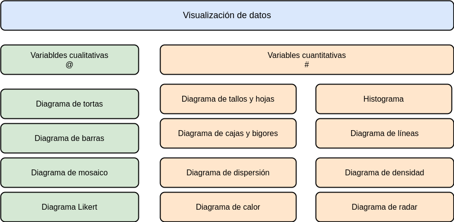

```{r setup, include=FALSE}
library(learnr)
knitr::opts_chunk$set(echo = FALSE,
                 exercise.warn_invisible = FALSE)
# colores
c1="#FF7F00" # NARANJA COLOR PRINCIPAL
c2="#034a94" # AZUL FUERTE COLOR SECUNDARIO  
c3="#0eb0c6" # AZUL CLARO COLOR TERCEARIO  
c4="#686868" # GRIS COLOR TEXTO 

```

## **PRESENTACIÓN**

```{r, echo=FALSE, out.width="60%", fig.align = "center"}

```

El presente tutorial contiene preguntas relacionadas con , 
conceptos importantes en 

</br>
  
#### **CONCEPTOS**

Dependiendo de el tipo de variable y el tipo de escala se elige el tipo de gráfica a utilizar para la representación de la variable.


|Tipo de variable | Tipos de escala  |  Tipo de gráfico            |  Sintaxis R            | 
|:----------------|:-----------------|:----------------------------|:-----------------------|
| cualitativa     | nominal          |  diagrama de torta          |  `pie(table(x))`       |
|                 | ordinal          |  diagrama de barras         |  `barplot(table(x))`   |
|cualitativa-cualitativa|            |  diag.barras dobles         |  `barplot(table(x,y))` |
|cualitativa-cualitativa|            |  diag. mosaico              |  `plot(x,y)`           |

</br>

|                 |                  |                             |                        |
|:----------------|:-----------------|:----------------------------|:-----------------------|
|cuantitativa     | intervalo/ razón |  diagrama de tallos y hojas | `stem(x)`              |
|                 | intervalo/ razón |  histograma                 | `hist(x)`              | 
|                 | intervalo/ razón |  diagrama de puntos         | `plot(x,y)`            |
|                 | intervalo/ razón |  diagrama de densidad       | `density(x)`           |
|                 | intervalo/ razón |  diagrama de cajas          | `boxplot(x)`           |
|                 | intervalo/ razón |  diagrama de linea          | `plot(x, type="l")`    |
| cuantitativa-cuantitativa| intervalo/ razón| diagrama de dispersión| `plot(x,y)`                        |

</br>

**Nota**: Además de estas formas de representación gráfica existen otras formas que combinan variables como:

+ Mapas
+ Diagrama de Mosaico
+ Diagramas de radar
+ Diagrama likert

</br></br>

#### **MAPA** 
  

```{r, echo=FALSE, , out.width="100%", fig.align = "center"}
  

```

## **CUESTIONARIO**

### **Pregunta 1**

```{r quiz_1}

quiz(
  question("La caja del diagrama de cajas y bigotes, representa: ", 
           correct = "Respuesta y explicación!, .", 
           allow_retry = TRUE,
           answer("El 50% de los valores al rededor de la media", message = "Cerca, pero no...intentalo de nuevo!"),
           answer("Todos los valores, menos los valores atípicos", message = "Nop...intentalo de nuevo!"),
           answer("Los valores comprendidos entre los cuartiles 25 y 75", message = "Incorrecto. Intenta de nuevo!."),
           answer("Ninguna de las anteriores", correct = TRUE),
           # Si no cambiamos estos textos en los botones, se mostrarán en Inglés  
           submit_button = "Enviar respuesta",
           try_again_button = "Intentar de nuevo"),
  # Si no ponemos un caption aparecerá la palabra Quiz en inglés.
  caption = "Visualización"
)

```


### **Pregunta 2**

```{r quiz_2}

quiz(
  question("¿Pregunta?", 
           correct = "Respuesta y explicación!, .", 
           allow_retry = TRUE,
           answer("opción 1", message = "Cerca, pero no...intentalo de nuevo!"),
           answer("opción 2", message = "Nop...intentalo de nuevo!"),
           answer("opción 3", message = "Incorrecto. Intenta de nuevo!."),
           answer("opción 4", correct = TRUE),
           # Si no cambiamos estos textos en los botones, se mostrarán en Inglés  
           submit_button = "Enviar respuesta",
           try_again_button = "Intentar de nuevo"),
  # Si no ponemos un caption aparecerá la palabra Quiz en inglés.
  caption = "Visualización"
)

```


### **Pregunta 3**

```{r quiz_3}

quiz(
  question("¿Pregunta?", 
           correct = "Respuesta y explicación!, .", 
           allow_retry = TRUE,
           answer("opción 1", message = "Cerca, pero no...intentalo de nuevo!"),
           answer("opción 2", message = "Nop...intentalo de nuevo!"),
           answer("opción 3", message = "Incorrecto. Intenta de nuevo!."),
           answer("opción 4", correct = TRUE),
           # Si no cambiamos estos textos en los botones, se mostrarán en Inglés  
           submit_button = "Enviar respuesta",
           try_again_button = "Intentar de nuevo"),
  # Si no ponemos un caption aparecerá la palabra Quiz en inglés.
  caption = "Visualización"
)

```

### **Pregunta 4**

```{r quiz_4}

quiz(
  question("¿Pregunta?", 
           correct = "Respuesta y explicación!, .", 
           allow_retry = TRUE,
           answer("opción 1", message = "Cerca, pero no...intentalo de nuevo!"),
           answer("opción 2", message = "Nop...intentalo de nuevo!"),
           answer("opción 3", message = "Incorrecto. Intenta de nuevo!."),
           answer("opción 4", correct = TRUE),
           # Si no cambiamos estos textos en los botones, se mostrarán en Inglés  
           submit_button = "Enviar respuesta",
           try_again_button = "Intentar de nuevo"),
  # Si no ponemos un caption aparecerá la palabra Quiz en inglés.
  caption = "Visualización"
)

```


### **Pregunta 5**

```{r quiz_5}

quiz(
  question("¿Pregunta?", 
           correct = "Respuesta y explicación!, .", 
           allow_retry = TRUE,
           answer("opción 1", message = "Cerca, pero no...intentalo de nuevo!"),
           answer("opción 2", message = "Nop...intentalo de nuevo!"),
           answer("opción 3", message = "Incorrecto. Intenta de nuevo!."),
           answer("opción 4", correct = TRUE),
           # Si no cambiamos estos textos en los botones, se mostrarán en Inglés  
           submit_button = "Enviar respuesta",
           try_again_button = "Intentar de nuevo"),
  # Si no ponemos un caption aparecerá la palabra Quiz en inglés.
  caption = "Visualización"
)

```


### **Pregunta 6**

```{r quiz_6}

quiz(
  question("¿Pregunta?", 
           correct = "Respuesta y explicación!, .", 
           allow_retry = TRUE,
           answer("opción 1", message = "Cerca, pero no...intentalo de nuevo!"),
           answer("opción 2", message = "Nop...intentalo de nuevo!"),
           answer("opción 3", message = "Incorrecto. Intenta de nuevo!."),
           answer("opción 4", correct = TRUE),
           # Si no cambiamos estos textos en los botones, se mostrarán en Inglés  
           submit_button = "Enviar respuesta",
           try_again_button = "Intentar de nuevo"),
  # Si no ponemos un caption aparecerá la palabra Quiz en inglés.
  caption = "Visualización"
)

```


### **Pregunta 7**

```{r quiz_7}

quiz(
  question("¿Pregunta?", 
           correct = "Respuesta y explicación!, .", 
           allow_retry = TRUE,
           answer("opción 1", message = "Cerca, pero no...intentalo de nuevo!"),
           answer("opción 2", message = "Nop...intentalo de nuevo!"),
           answer("opción 3", message = "Incorrecto. Intenta de nuevo!."),
           answer("opción 4", correct = TRUE),
           # Si no cambiamos estos textos en los botones, se mostrarán en Inglés  
           submit_button = "Enviar respuesta",
           try_again_button = "Intentar de nuevo"),
  # Si no ponemos un caption aparecerá la palabra Quiz en inglés.
  caption = "Visualización"
)

```


### **Pregunta 8**

```{r quiz_8}

quiz(
  question("¿Pregunta?", 
           correct = "Respuesta y explicación!, .", 
           allow_retry = TRUE,
           answer("opción 1", message = "Cerca, pero no...intentalo de nuevo!"),
           answer("opción 2", message = "Nop...intentalo de nuevo!"),
           answer("opción 3", message = "Incorrecto. Intenta de nuevo!."),
           answer("opción 4", correct = TRUE),
           # Si no cambiamos estos textos en los botones, se mostrarán en Inglés  
           submit_button = "Enviar respuesta",
           try_again_button = "Intentar de nuevo"),
  # Si no ponemos un caption aparecerá la palabra Quiz en inglés.
  caption = "Visualización"
)

```


### **Pregunta 9**

```{r quiz_9}

quiz(
  question("¿Pregunta?", 
           correct = "Respuesta y explicación!, .", 
           allow_retry = TRUE,
           answer("opción 1", message = "Cerca, pero no...intentalo de nuevo!"),
           answer("opción 2", message = "Nop...intentalo de nuevo!"),
           answer("opción 3", message = "Incorrecto. Intenta de nuevo!."),
           answer("opción 4", correct = TRUE),
           # Si no cambiamos estos textos en los botones, se mostrarán en Inglés  
           submit_button = "Enviar respuesta",
           try_again_button = "Intentar de nuevo"),
  # Si no ponemos un caption aparecerá la palabra Quiz en inglés.
  caption = "Visualización"
)

```


### **Pregunta 10**

```{r quiz_10}

quiz(
  question("¿Pregunta?", 
           correct = "Respuesta y explicación!, .", 
           allow_retry = TRUE,
           answer("opción 1", message = "Cerca, pero no...intentalo de nuevo!"),
           answer("opción 2", message = "Nop...intentalo de nuevo!"),
           answer("opción 3", message = "Incorrecto. Intenta de nuevo!."),
           answer("opción 4", correct = TRUE),
           # Si no cambiamos estos textos en los botones, se mostrarán en Inglés  
           submit_button = "Enviar respuesta",
           try_again_button = "Intentar de nuevo"),
  # Si no ponemos un caption aparecerá la palabra Quiz en inglés.
  caption = "Visualización"
)

```

