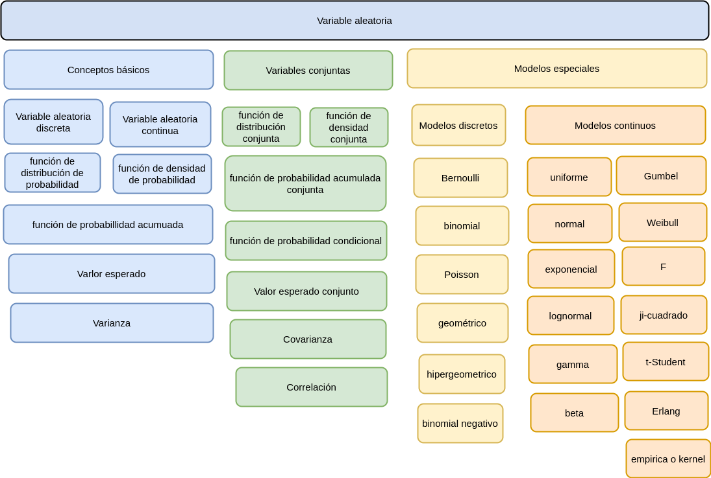

```{r setup, include=FALSE}
library(learnr)
knitr::opts_chunk$set(echo = FALSE,
                 exercise.warn_invisible = FALSE)
# colores
c1="#FF7F00" # NARANJA COLOR PRINCIPAL
c2="#034a94" # AZUL FUERTE COLOR SECUNDARIO  
c3="#0eb0c6" # AZUL CLARO COLOR TERCEARIO  
c4="#686868" # GRIS COLOR TEXTO 

```
## **PRESENTACIÓN**

```{r, echo=FALSE, out.width="100%", fig.align = "center"}
knitr::include_graphics("images/banner2.png")
```

El presente tutorial contiene preguntas y problemas  relacionadas con los temas abordados en la Unidad 2 sobre Variable Aleatoria. Conceptos importantes para la compresión de la Inferencia Estadística.

</br>
  
### **CONCEPTOS**

</br>

##### **VARIABLE ALEATORIA**

Una variable aleatoria $X$ es una función que asigna a cada valor de un espacio muestral $S$ un número . El conjunto formado por estos números conforman un subconjunto de los  reales llamado rango de la variable X, ($R_{_{X}}$). Asociado a cada número se define un valor de probabilidad a través de $f(x)$. 

</br>

#### **VARIABLES DISCRETAS**

Una variable $X$ se considera **DISCRETA** si su rango $R_{_{X}}$ es un conjunto finito o infinito numerable de valores.

</br>

#### **VARIABLES CONTINUAS**

Se considera **CONTINUA** si su rango $R_{_{X}}$ es un conjunto de valores infinito no numerable y generalmente corresponde a unión de intervalos.

</br>

#### **FUNCIÓN DE DISTRIBUCIÓN DE PROBABILIDAD**

Para $X$ un variable aleatoria discreta, su función de distribución de probabilidad estará dada por $f(x)$, la cual proporciona las probabilidades asociadas a todos los valores de su rango $R_{X}$ . Esta función debe cumplir las siguientes propiedades: ($i$) $f(x) = P(X=x) \geq 0$, ($ii$) $\sum_{R_X} f(x) = 1$

</br>

#### **FUNCIÓN DE DENSIDAD DE PROBABILIDAD**

Para el caso de las variables aleatorias continuas se define como función de densidad de probablidad a $f(x)$, tal que cumpla las siguientes condiciones: ($i$) $f(x) \geq 0$, ($ii$) $\int\limits_{-\infty}^{+\infty}f(x)\:dx =1$. 
Además se define : $P(a < X < b)=\int\limits_{a}^{b}f(x)\:dx$

</br>

#### **FUNCIÓN DE PROBABILIDAD ACUMULADA**

Para $X$ una variable aleatoria continua con función de densidad $f_{X}(x)$, se define la  función de distribución acumulada, $F_{X}(x)$, como: 

Caso discreto
$$F(x)=P(X\leq x)=\sum _{t \leq x}f(t)$$ 
Caso continuo
$$F_{_{X,Y}}(x,y) = P(X\leq x; Y \leq y) = \int_{-\infty}^{x} \int_{-\infty}^{y} f(s,t) \:ds \:dt$$
</br>

#### **VALOR ESPERADO**

Sea $X$ una variable aleatoria discreta o continua. La esperanza matemática de $X$ o valor esperado, $E(X)$ o bien $\mu$, se define respectivamente como: 

</br>

Caso discreto
$$E(X) = \sum\limits_{x}^{}x_{i}f(x_{i})$$ 
Caso continuo
$$E(X) = \int\limits_{-\infty}^{+\infty}x f(x) \:dx$$  


</br>

#### **VARIANZA**

Se define como varianza la diferencia entre el segundo momento y el cuadrado del primer momento 

$$V[X] = E[X^{2}]-(E[X])^{2}  = E[X^{2}]-\mu^{2}  = \sigma^{2}$$ 
</br>

#### **VARIABLE ALEATORIA CONJUNTA**

Se define como una pareja de de variables aleatorias ($X,Y$), que poseen una distribución de probabilidad conjunta $f_{_{X,Y}}(x,y)$, que debe ser positiva en todos sus valores y además que el conjunto total de sus valores debe ser igual a uno.

</br>

Caso discreto-discreto
$$\displaystyle\sum\limits_{x=x_{(1)}}^{x_{(n)}}\displaystyle\sum\limits_{y=y_{(1)}}^{y_{(n)}}f_{_{X,Y}}(x,y)=1$$

Caso continuo-continuo
$$\int_{-\infty}^{\infty} \int_{-\infty}^{\infty} f(x,y) \:dx \:dy  = 1$$

</br>

#### **VALOR ESPERADO CONJUNTO**

Caso discreto-discreto:
$$E[X,Y]=\displaystyle\sum_{R_{X}}\displaystyle\sum_{R_{Y}} xy f(x,y)$$

Caso continuo-continuo
$$E[XY]= \displaystyle\int_{-\infty}^{\infty} \displaystyle\int_{-\infty}^{\infty} x.y.f(x,y) \,dx \,dy$$

</br>

#### **COVARIANZA**

Indicador de variabilidad bivariado

$$COV[X,Y]=E[XY]-E[X]E[Y]$$

</br>

#### **CORRELACIÓN**

Indicador del grado de asociación lineal entre dos variables

$$\rho=\displaystyle\frac{COV[XY]}{\displaystyle\sqrt{V[X].V[Y]}} $$

  
</br></br>

### **MAPA** 
  

```{r, echo=FALSE, , out.width="100%", fig.align = "center"}
  

```

## **CUESTIONARIO**

### **Pregunta 1**

En relación con la distribución normal con función de densidad :

$$f(x)= \dfrac{1}{\sqrt{2\pi \sigma^{2}}} \hspace{.1cm} e^{-\big(\frac{1}{2\sigma^{2}}(x-\mu)^{2}\big)}	 \hspace{.5cm}  -\infty \leq  x \leq \infty $$ 

```{r quiz_1}

quiz(
  question("¿Cuál de las siguientes afirmaciones es falsa?:", 
           correct = "Correcto!, la distribución normal corresponde a una variable continua.", 
           allow_retry = TRUE,
           answer("Es una distribución de probabilidad teórica discreta.", correct = TRUE),
           answer("La distancia entre el eje vertical trazado en la media y el punto de inflexión de la curva es la desviación estándar.", message = "Nop...intentalo de nuevo!"),
           answer("Es simétrica y unimodal.", message = "Incorrecto. Intenta de nuevo!."),
           answer("Cualquier valor entre – infinito y + infinito es teóricamente posible.", message = "Cerca, pero no...intentalo de nuevo!"),
           # Si no cambiamos estos textos en los botones, se mostrarán en Inglés  
           submit_button = "Enviar respuesta",
           try_again_button = "Intentar de nuevo"),
  # Si no ponemos un caption aparecerá la palabra Quiz en inglés.
  caption = " "
)

```


### **Pregunta 2**

Cuando se requiere calcular la probabilidad de $P(X = x)$, en el caso de una variable aleatoria discreta,

```{r quiz_2}

quiz(
  question("Es necesario conocer para hallar su valor: ", 
           correct = "Correcto!, al reemplazar x en (x) se obtiene el valor de P(X=x).", 
           allow_retry = TRUE,
           answer("V[X]", message = "No...intentalo de nuevo!"),
           answer("F(x)", message = "No...intentalo de nuevo!"),
           answer("f(x)", correct = TRUE),
           answer("E[X]", message = "Incorrecto. Intenta de nuevo!."),
           # Si no cambiamos estos textos en los botones, se mostrarán en Inglés  
           submit_button = "Enviar respuesta",
           try_again_button = "Intentar de nuevo"),
  # Si no ponemos un caption aparecerá la palabra Quiz en inglés.
  caption = "  "
)

```


### **Pregunta 3**

La siguiente función

$$\begin{equation*}
		f(x)=\left\lbrace
		\begin{array}{lll}
			\lambda \exp{\{-\lambda x\}}  &,& x > 0   \\
			&&\\
			0 &,& x \leq 0 
		\end{array}
		\right.
	\end{equation*}$$
	
	está definida para una variable aleatoria.

```{r quiz_3}

quiz(
  question("De ella podemos afirmar que", 
           correct = "Correcto!, f(x) corresponde a un modelo continuo, más concretamente el modelo exponencial.", 
           allow_retry = TRUE,
           answer("La variable aleatoria X,es discreta  para valores mayores a cero", message = "No,...pero intentalo de nuevo!"),
           answer("La variable no esta definida para valores discretos", message = "No...intentalo de nuevo!"),
           answer("La variable X, es continua con valores mayores a cero", correct = TRUE),
           answer("f(x) no cumple con las condiciones requeridas y por tanto X no es una variable aleatoria", message = "Incorrecto. Intenta de nuevo!."),
           # Si no cambiamos estos textos en los botones, se mostrarán en Inglés  
           submit_button = "Enviar respuesta",
           try_again_button = "Intentar de nuevo"),
  # Si no ponemos un caption aparecerá la palabra Quiz en inglés.
  caption = " "
)

```

### **Pregunta 4**

Para una variable aleatoria continua con función de densidad de probabilidad :

$$\begin{equation*}
		f(x)=\left\lbrace
		\begin{array}{lll}
			k   &,& 0 \leq x \leq 1   \\
			&&\\
			0 &,& \text{en otro caso} 
		\end{array}
		\right.
	\end{equation*}$$

```{r quiz_4}

quiz(
  question("f(x) será una función de densidad de probabilidad si: ", 
           correct = "Correcto!, f(x) corresponde a una linea horizontal entre 0 y 1. El área por debajo de la función conforma un cuadrado con base uno y por tanto la altura (k) debe ser igual a uno.", 
           allow_retry = TRUE,
           answer("k = 0", message = "No, pero intentalo de nuevo!"),
           answer("k = 1", correct = TRUE),
           answer("k = 1/2", message = "Incorrecto. Intenta de nuevo!."),
           answer("k = 1/4", message = "No...intentalo de nuevo!"),
           # Si no cambiamos estos textos en los botones, se mostrarán en Inglés  
           submit_button = "Enviar respuesta",
           try_again_button = "Intentar de nuevo"),
  # Si no ponemos un caption aparecerá la palabra Quiz en inglés.
  caption = " "
)

```


### **Pregunta 5**

La siguiente función $f_{_{XY}}(x,y)$ define las probabidades conjuntas entre X: número de inconvenientes presentadas en un vehiculo de carga en su viaje de ida  y Y: el número de inconvenientes que se presentan en el viaje de regreso.

|    |        |       |  $x$ |      |
|:--:|:------:|:-----:|:----:|:----:|
|    |$f(x,y)$| 1     |  2   |  3   |
|$y$ |  1     | 0.05  | 0.05 | 0.10 |
|    |  2     | 0.05 | 0.10 | 0.35  |
|    |  3     | 0     | 0.20 | 0.10 |

```{r quiz_5}

quiz(
  question("No es correcto afirmar que:", 
           correct = "Correcto!, P(X<2 ; Y<2) = 0.05.", 
           allow_retry = TRUE,
           answer("E[X] = 0.1 + 2*0.35 + 3*0.55", message = "No...intentalo de nuevo!"),
           answer("P(2,2) = 0.10", message = "No...intentalo de nuevo!"),
           answer("E[Y] = 0.2+0.50*2+0.30*3", message = "Incorrecto. Intenta de nuevo!."),
           answer("P(X<2 ; Y<2) = 0.05+ 0.05", correct = TRUE),
           # Si no cambiamos estos textos en los botones, se mostrarán en Inglés  
           submit_button = "Enviar respuesta",
           try_again_button = "Intentar de nuevo"),
  # Si no ponemos un caption aparecerá la palabra Quiz en inglés.
  caption = " "
)

```


### **Pregunta 6**

Suponga que una variable aleatoria discreta está definida por la siguiente función de distribución de probabilidad:

| $x$    |   $0$  |  $1$   |  $2$   |
|:-------|:-------|:-------|:-------|
| $f(x)$ |  $1/3$ | $1/2$  | $1/6$  |


```{r quiz_6}

quiz(
  question("No es correcto afirmar que:  ", 
           correct = "Correcto!, E[X] = 0 * 1/3 + 1 * 1/2 + 2 * 1/6.", 
           allow_retry = TRUE,
           answer("E[X] = 1/2 + 1/6", correct = TRUE),
           answer("V[X] = 1/2 + 9/6 - 25/36", message = "No...intentalo de nuevo!"),
           answer("f(x), es una función de distribución de probabilidad", message = "Incorrecto. Intenta de nuevo!."),
           answer("F(1) = 5/6", message = "No...intentalo de nuevo!"),
           # Si no cambiamos estos textos en los botones, se mostrarán en Inglés  
           submit_button = "Enviar respuesta",
           try_again_button = "Intentar de nuevo"),
  # Si no ponemos un caption aparecerá la palabra Quiz en inglés.
  caption = " "
)

```


### **Pregunta 7**

```{r quiz_7}

quiz(
  question("¿Pregunta?", 
           correct = "Respuesta y explicación!, .", 
           allow_retry = TRUE,
           answer("opción 1", message = "Cerca, pero no...intentalo de nuevo!"),
           answer("opción 2", message = "Nop...intentalo de nuevo!"),
           answer("opción 3", message = "Incorrecto. Intenta de nuevo!."),
           answer("opción 4", correct = TRUE),
           # Si no cambiamos estos textos en los botones, se mostrarán en Inglés  
           submit_button = "Enviar respuesta",
           try_again_button = "Intentar de nuevo"),
  # Si no ponemos un caption aparecerá la palabra Quiz en inglés.
  caption = "Visualización"
)

```


### **Pregunta 8**

```{r quiz_8}

quiz(
  question("¿Pregunta?", 
           correct = "Respuesta y explicación!, .", 
           allow_retry = TRUE,
           answer("opción 1", message = "Cerca, pero no...intentalo de nuevo!"),
           answer("opción 2", message = "Nop...intentalo de nuevo!"),
           answer("opción 3", message = "Incorrecto. Intenta de nuevo!."),
           answer("opción 4", correct = TRUE),
           # Si no cambiamos estos textos en los botones, se mostrarán en Inglés  
           submit_button = "Enviar respuesta",
           try_again_button = "Intentar de nuevo"),
  # Si no ponemos un caption aparecerá la palabra Quiz en inglés.
  caption = "Visualización"
)

```


### **Pregunta 9**

```{r quiz_9}

quiz(
  question("¿Pregunta?", 
           correct = "Respuesta y explicación!, .", 
           allow_retry = TRUE,
           answer("opción 1", message = "Cerca, pero no...intentalo de nuevo!"),
           answer("opción 2", message = "Nop...intentalo de nuevo!"),
           answer("opción 3", message = "Incorrecto. Intenta de nuevo!."),
           answer("opción 4", correct = TRUE),
           # Si no cambiamos estos textos en los botones, se mostrarán en Inglés  
           submit_button = "Enviar respuesta",
           try_again_button = "Intentar de nuevo"),
  # Si no ponemos un caption aparecerá la palabra Quiz en inglés.
  caption = "Visualización"
)

```


### **Pregunta 10**

```{r quiz_10}

quiz(
  question("¿Pregunta?", 
           correct = "Respuesta y explicación!, .", 
           allow_retry = TRUE,
           answer("opción 1", message = "Cerca, pero no...intentalo de nuevo!"),
           answer("opción 2", message = "Nop...intentalo de nuevo!"),
           answer("opción 3", message = "Incorrecto. Intenta de nuevo!."),
           answer("opción 4", correct = TRUE),
           # Si no cambiamos estos textos en los botones, se mostrarán en Inglés  
           submit_button = "Enviar respuesta",
           try_again_button = "Intentar de nuevo"),
  # Si no ponemos un caption aparecerá la palabra Quiz en inglés.
  caption = "Visualización"
)

```


## **PROBLEMAS**


### **Problema 1**

Enunciado

```{r p1, exercise=TRUE, exercise.lines = 5}


```


```{r p1-hint}


```


```{r p1-solution}

```


### **Problema 2*

Enunciado

```{r p2, exercise=TRUE, exercise.lines = 5}


```


```{r p2-hint}


```


```{r p2-solution}

```


### **Problema 3**

Enunciado

```{r p3, exercise=TRUE, exercise.lines = 5}


```


```{r p3-hint}


```


```{r p3-solution}

```


### **Problema 4**

Enunciado

```{r p4, exercise=TRUE, exercise.lines = 5}


```


```{r p4-hint}


```


```{r p4-solution}

```


### **Problema 5**

Enunciado

```{r p5, exercise=TRUE, exercise.lines = 5}


```


```{r p5-hint}


```


```{r p5-solution}

```


### **Problema 6**
Enunciado

```{r p6, exercise=TRUE, exercise.lines = 5}


```


```{r p6-hint}


```


```{r p6-solution}

```


### **Problema 7**

Enunciado

```{r p7, exercise=TRUE, exercise.lines = 5}


```


```{r p7-hint}


```


```{r p7-solution}

```


### **Problema 8**

Enunciado

```{r p8, exercise=TRUE, exercise.lines = 5}


```


```{r p8-hint}


```


```{r p8-solution}

```


### **Problema 9**

Enunciado

```{r p9, exercise=TRUE, exercise.lines = 5}


```


```{r p9-hint}


```


```{r p9-solution}

```


### **Problema 10**

Enunciado

```{r p10, exercise=TRUE, exercise.lines = 5}


```


```{r p10-hint}


```


```{r p10-solution}

```

