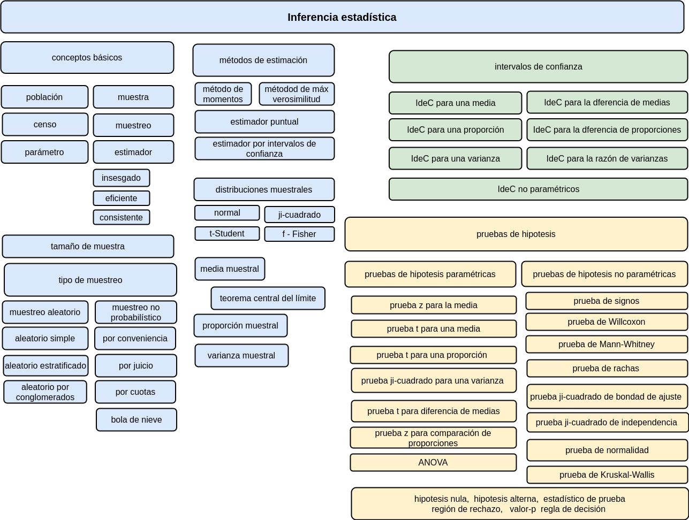

```{r setup, include=FALSE}
library(learnr)
knitr::opts_chunk$set(echo = FALSE,
                 exercise.warn_invisible = FALSE)
# colores
c1="#FF7F00" # NARANJA COLOR PRINCIPAL
c2="#034a94" # AZUL FUERTE COLOR SECUNDARIO  
c3="#0eb0c6" # AZUL CLARO COLOR TERCEARIO  
c4="#686868" # GRIS COLOR TEXTO 

```

## **PRESENTACIÓN**

```{r, echo=FALSE, out.width="100%", fig.align = "center"}
knitr::include_graphics("images/banner2.png")
```

El presente tutorial contiene preguntas relacionadas con , 
conceptos importantes en 

</br>
  
#### **CONCEPTOS**
  
</br></br>

#### **MAPA** 
  

```{r, echo=FALSE, , out.width="100%", fig.align = "center"}
  

```

## **CUESTIONARIO**

### **Pregunta 1**

```{r quiz_1}

quiz(
  question("¿La muestra es un subconjunto de la población que..", 
           correct = "Respuesta y explicación!, .", 
           allow_retry = TRUE,
           answer("Es necesaria tener para hacer estadística", message = "Cerca, pero no...intentalo de nuevo!"),
           answer("Es lo más representativo de la población", message = "Nop...intentalo de nuevo!"),
           answer("Es un subconjunto extraido al azar de la población", message = "Incorrecto. Intenta de nuevo!."),
           answer("Es seleccionada para estimar un parámetro de interés de la población 4", correct = TRUE),
           # Si no cambiamos estos textos en los botones, se mostrarán en Inglés  
           submit_button = "Enviar respuesta",
           try_again_button = "Intentar de nuevo"),
  # Si no ponemos un caption aparecerá la palabra Quiz en inglés.
  caption = "Visualización"
)

```


### **Pregunta 2**

```{r quiz_2}

quiz(
  question("El tamaño de muestra", 
           correct = "Respuesta y explicación!, .", 
           allow_retry = TRUE,
           answer("Es proporcional al tamaño de la población 1", message = "Cerca, pero no...intentalo de nuevo!"),
           answer("Es el 5% del tamaño de la población", message = "Nop...intentalo de nuevo!"),
           answer("Se calcula sobre la base de la estratificación", message = "Incorrecto. Intenta de nuevo!."),
           answer("Depende de la dispersión de la población", correct = TRUE),
           # Si no cambiamos estos textos en los botones, se mostrarán en Inglés  
           submit_button = "Enviar respuesta",
           try_again_button = "Intentar de nuevo"),
  # Si no ponemos un caption aparecerá la palabra Quiz en inglés.
  caption = "Visualización"
)

```


### **Pregunta 3**

```{r quiz_3}

quiz(
  question("¿Pregunta?", 
           correct = "Respuesta y explicación!, .", 
           allow_retry = TRUE,
           answer("opción 1", message = "Cerca, pero no...intentalo de nuevo!"),
           answer("opción 2", message = "Nop...intentalo de nuevo!"),
           answer("opción 3", message = "Incorrecto. Intenta de nuevo!."),
           answer("opción 4", correct = TRUE),
           # Si no cambiamos estos textos en los botones, se mostrarán en Inglés  
           submit_button = "Enviar respuesta",
           try_again_button = "Intentar de nuevo"),
  # Si no ponemos un caption aparecerá la palabra Quiz en inglés.
  caption = "Visualización"
)

```

### **Pregunta 4**

```{r quiz_4}

quiz(
  question("¿Pregunta?", 
           correct = "Respuesta y explicación!, .", 
           allow_retry = TRUE,
           answer("opción 1", message = "Cerca, pero no...intentalo de nuevo!"),
           answer("opción 2", message = "Nop...intentalo de nuevo!"),
           answer("opción 3", message = "Incorrecto. Intenta de nuevo!."),
           answer("opción 4", correct = TRUE),
           # Si no cambiamos estos textos en los botones, se mostrarán en Inglés  
           submit_button = "Enviar respuesta",
           try_again_button = "Intentar de nuevo"),
  # Si no ponemos un caption aparecerá la palabra Quiz en inglés.
  caption = "Visualización"
)

```


### **Pregunta 5**

```{r quiz_5}

quiz(
  question("En el muestreo", 
           correct = "Respuesta y explicación!, .", 
           allow_retry = TRUE,
           answer("No debe haber error", message = "No...intentalo de nuevo!"),
           answer("Es importante conseguir un tamaño de muestra grande", message = "Nop...intentalo de nuevo!"),
           answer("Se calculael tamaño óptimo para un determinado nivel de error", correct = TRUE),
           answer("El error no debe superar el 3%", message = "Incorrecto. Intenta de nuevo!."),
           # Si no cambiamos estos textos en los botones, se mostrarán en Inglés  
           submit_button = "Enviar respuesta",
           try_again_button = "Intentar de nuevo"),
  # Si no ponemos un caption aparecerá la palabra Quiz en inglés.
  caption = "Visualización"
)

```


### **Pregunta 6**

```{r quiz_6}

quiz(
  question("El nivel de significación o de significancia es la probabilidad de:", 
           correct = "Respuesta y explicación!, .", 
           allow_retry = TRUE,
           answer("Rechazar Ho, cuando ésta es falsa", message = "Cerca, pero no...intentalo de nuevo!"),
           answer("Rechazar Ho, cuando ésta es verdadera", correct = TRUE),
           answer("No rechazar Ho, cuando Ho es falsa", message = "Incorrecto. Intenta de nuevo!."),
           answer("No rechazar Ho, cuando Ho es verdadera", message = "Nop...intentalo de nuevo!"),
           # Si no cambiamos estos textos en los botones, se mostrarán en Inglés  
           submit_button = "Enviar respuesta",
           try_again_button = "Intentar de nuevo"),
  # Si no ponemos un caption aparecerá la palabra Quiz en inglés.
  caption = "Visualización"
)

```


### **Pregunta 7**

```{r quiz_7}

quiz(
  question("Respecto a las pruebas de hipótesis señale lo falso:", 
           correct = "Respuesta y explicación!, .", 
           allow_retry = TRUE,
           answer("Es un procedimiento por el cual nos decidimos por la hipótesis nula (Ho) o por la alternativa (Ha).", message = "Cerca, pero no...intentalo de nuevo!"),
           answer("La Ha es la que se pone a prueba al realizar una prueba estadística.", message = "Nop...intentalo de nuevo!"),
           answer("La Ha es al que se aceptará si el resultado de la prueba permite rechazar la Ho.", message = "Incorrecto. Intenta de nuevo!."),
           answer("La significancia estadística es la condición resultante del rechazo de la Ho.", correct = TRUE),
           # Si no cambiamos estos textos en los botones, se mostrarán en Inglés  
           submit_button = "Enviar respuesta",
           try_again_button = "Intentar de nuevo"),
  # Si no ponemos un caption aparecerá la palabra Quiz en inglés.
  caption = "Visualización"
)

```


### **Pregunta 8**

```{r quiz_8}

quiz(
  question("¿Pregunta?", 
           correct = "Respuesta y explicación!, .", 
           allow_retry = TRUE,
           answer("opción 1", message = "Cerca, pero no...intentalo de nuevo!"),
           answer("opción 2", message = "Nop...intentalo de nuevo!"),
           answer("opción 3", message = "Incorrecto. Intenta de nuevo!."),
           answer("opción 4", correct = TRUE),
           # Si no cambiamos estos textos en los botones, se mostrarán en Inglés  
           submit_button = "Enviar respuesta",
           try_again_button = "Intentar de nuevo"),
  # Si no ponemos un caption aparecerá la palabra Quiz en inglés.
  caption = "Visualización"
)

```


### **Pregunta 9**

```{r quiz_9}

quiz(
  question("¿Pregunta?", 
           correct = "Respuesta y explicación!, .", 
           allow_retry = TRUE,
           answer("opción 1", message = "Cerca, pero no...intentalo de nuevo!"),
           answer("opción 2", message = "Nop...intentalo de nuevo!"),
           answer("opción 3", message = "Incorrecto. Intenta de nuevo!."),
           answer("opción 4", correct = TRUE),
           # Si no cambiamos estos textos en los botones, se mostrarán en Inglés  
           submit_button = "Enviar respuesta",
           try_again_button = "Intentar de nuevo"),
  # Si no ponemos un caption aparecerá la palabra Quiz en inglés.
  caption = "Visualización"
)

```


### **Pregunta 10**

```{r quiz_10}

quiz(
  question("¿Pregunta?", 
           correct = "Respuesta y explicación!, .", 
           allow_retry = TRUE,
           answer("opción 1", message = "Cerca, pero no...intentalo de nuevo!"),
           answer("opción 2", message = "Nop...intentalo de nuevo!"),
           answer("opción 3", message = "Incorrecto. Intenta de nuevo!."),
           answer("opción 4", correct = TRUE),
           # Si no cambiamos estos textos en los botones, se mostrarán en Inglés  
           submit_button = "Enviar respuesta",
           try_again_button = "Intentar de nuevo"),
  # Si no ponemos un caption aparecerá la palabra Quiz en inglés.
  caption = "Visualización"
)

```


## **PROBLEMAS**


### **Problema 1**

Enunciado

```{r p1, exercise=TRUE, exercise.lines = 5}


```


```{r p1-hint}


```


```{r p1-solution}

```


### **Problema 2*

Enunciado

```{r p2, exercise=TRUE, exercise.lines = 5}


```


```{r p2-hint}


```


```{r p2-solution}

```


### **Problema 3**

Enunciado

```{r p3, exercise=TRUE, exercise.lines = 5}


```


```{r p3-hint}


```


```{r p3-solution}

```


### **Problema 4**

Enunciado

```{r p4, exercise=TRUE, exercise.lines = 5}


```


```{r p4-hint}


```


```{r p4-solution}

```


### **Problema 5**

Enunciado

```{r p5, exercise=TRUE, exercise.lines = 5}


```


```{r p5-hint}


```


```{r p5-solution}

```


### **Problema 6**
Enunciado

```{r p6, exercise=TRUE, exercise.lines = 5}


```


```{r p6-hint}


```


```{r p6-solution}

```


### **Problema 7**

Enunciado

```{r p7, exercise=TRUE, exercise.lines = 5}


```


```{r p7-hint}


```


```{r p7-solution}

```


### **Problema 8**

Enunciado

```{r p8, exercise=TRUE, exercise.lines = 5}


```


```{r p8-hint}


```


```{r p8-solution}

```


### **Problema 9**

Enunciado

```{r p9, exercise=TRUE, exercise.lines = 5}


```


```{r p9-hint}


```


```{r p9-solution}

```


### **Problema 10**

Enunciado

```{r p10, exercise=TRUE, exercise.lines = 5}


```


```{r p10-hint}


```


```{r p10-solution}

```


